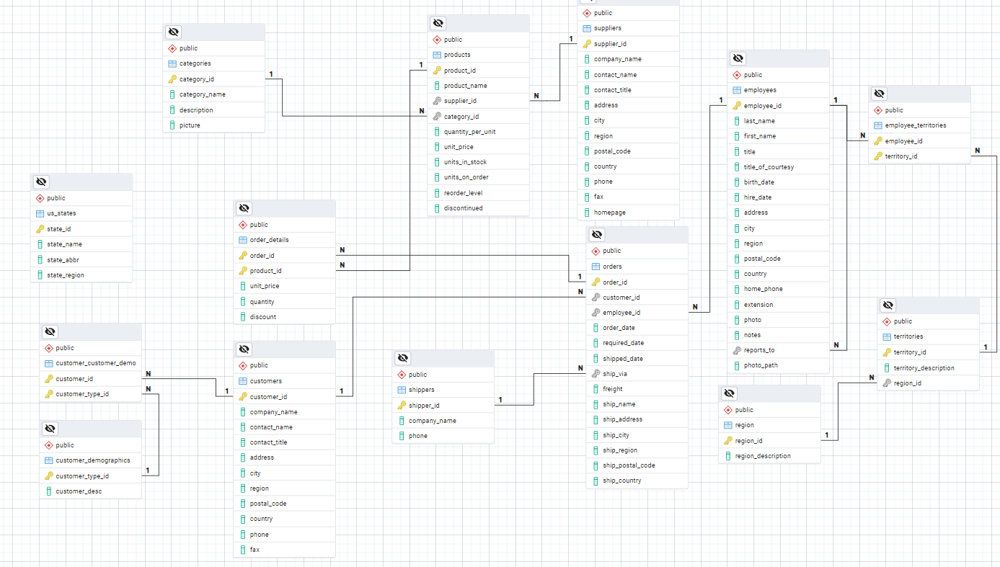

# ElasticSearchTp1

## Phase 1 : Annalyse du modéle relationnel

1. Explorer la structure de la base de données Northwind :

clé primaire : 
    - categories : category_id
	- products : product_id
	- suppliers : supplier_id
	- employees : employee_id
	- employee_territories: employee_id, territory_id
	- territories : territory_id
	- region : region_id
	- customers : customer_id
	- customer_customer_demo : customer_id, customer_type_id
	- customer_demographics : customer_type_id
	- orders : order_id
	- order_details_ : order_id, product_id
	- shippers : shipper_id
	- us_states : state_id

2. Identifier les relations entre les tables :



relation one to many et many to one :
  - category one to many products
  - product many to one supplier
  - product one to many order_details
  - order_details many to one orders
  - order_details many to one products
  - customers one to many orders
  - customers one to many customer_customer_demo
  - customer demographics one to many customer_customer_demo
  - employee_terrritoire many to one avec territoires
  - employee_terrritoire many to one avec employees
  - territoire many to one avec region
  - employees many to one avec employee
  - employee one to many avec order
  - order many to one avec shippers

3. Analyser les cas d'usage typiques pour la recherche

Type de recherche:
  - keyword

Recherche pertinentes : 
  - categorie
  - product
  - customer
  - orders

4. Définir les objectifs pour l'index Elasticsearch
  
  products :
  - product_name
  - supplier :
    - company_name
    - country
  - category:
    - category_name
  - unit price

  order : 
  - order_date
  - customer:
    - company_name
	-  contact_name
	- country
  - order_detail:
	- product_name
	- unit_price
	- quantity
	- discount
  - order_id
  - shipped_date
  - ship_address
  - ship_city
  - ship_region
  - ship_postal_code
  - ship_country

## Phase 2 : Conception du mapping ElasticSearch
1. Déterminer quelles tables doivent être dénormalisées

Données a fusionner:
  - fusion les champs concernat l'adresse (city, region, country, etc.) de customer et orders

Données à embarquer dans les documents : 
  - fournisseurs dans products
  - catégories dans product
  - customer dans order
  - order_details dans order

2. Concevoir la structure des documents

- product:
```json
{
	"product_name": "phone",
	"supplier":{
		"company_name": "samsung",
		"country": "china",
	},
	"category": {
		"category_name": "Technologies",
	},
	"unit_prices":1.00,
}
```

- order:
```json
{
	"order_date": "2023-10-01",
	"customer": {
		"company_name": "samsung",
		"contact_name": "samsung",
		"country": "china",
	},
	"order_id": 1,
	"shipped_date": "2023-10-01",
	"ship_address": "address",
	"ship_city": "city",
	"ship_region": "region",
	"ship_postal_code": "postal_code",
	"ship_country": "country",
	"order_details": [
		{
			"product_name": "phone",
			"unit_price": 1.00,
			"quantity": 1,
			"discount": 0.00
		},
		{
			"product_name": "tablet",
			"unit_price": 2.00,
			"quantity": 2,
			"discount": 0.00
		}
	]
}
```

3. Définir les types de données pour chaque champ
- product:
```json
{
	"product_name": text,
	"supplier":{
		"company_name": text,
		"country": text,
	},
	"category": {
		"category_name": text,
	},
	"unit_prices": double,
}
```

- order:
```json
{
	"order_date": date,
	"customer": {
		"company_name": text,
		"contact_name": text,
		"country": text,
	},
	"order_id": guid,
	"shipped_date": date,
	"ship_address": text,
	"ship_city": text,
	"ship_region": text,
	"ship_postal_code": numeric,
	"ship_country": text,
	"order_details": [
		{
			"product_name": text,
			"unit_price": double,
			"quantity": numeric,
			"discount": double
		},
		{
			"product_name": text,
			"unit_price": double,
			"quantity": numeric,
			"discount": double
		}
	]
}
```

Les champs qui doivent être analysées pour la recherche full text sont :
  - product_name,
  - company_name, 
  - category_name, 
  - order_date, 
  - customer_name, 
  - order_id, 
  - shipped_date, 
  - ship_address, 
  - ship_city, 
  - ship_region, 
  - ship_postal_code,
  - ship_country, 
  - product_name, 
  - unit_price,
  - quantity,
  - discount

4. Configurer les analyseurs appropriés

Dans la requête de création d'index mettre le json suivant pour l'analyzer :

```json
{
    "settings": {
        "analysis":{
            "analyzer":{
                "product_name":
                {
                    "type": "custom",
                    "tokenizer": "standard",
                    "filter":[
                        "lowercase",
                        "asciifolding",
                        "trim",
                        "word_delimiter_graph"
                    ]
                }
            }
        }
    }
}
```

Rajouter dans la requête, pour configurer les options d'analyse appropriées pour les champs textuels:

```json
{
	"settings": {
		"analysis": {
		  "analyzer": {
			"my_custom_analyzer": {
			  "type": "custom",
			  "tokenizer": "standard",
			  "char_filter": [
				"html_strip"
			  ],
			  "filter": [
				"lowercase",
				"asciifolding",
				"trim"
			  ]
			},
			"product_name_analyzer": {
			  "type": "custom",
			  "tokenizer": "standard",
			  "filter": [
				"lowercase",
				"asciifolding",
				"word_delimiter_graph"
			  ]
			},
			"french_content": {
			  "type": "custom",
			  "tokenizer": "standard",
			  "filter": [
				"lowercase",
				"french_stop",
				"french_stemmer"
			  ]
			}
		  },
		}
	  }
}
```

5. Créer le mapping dans Elasticsearch
index products :
```json
{

}
```
