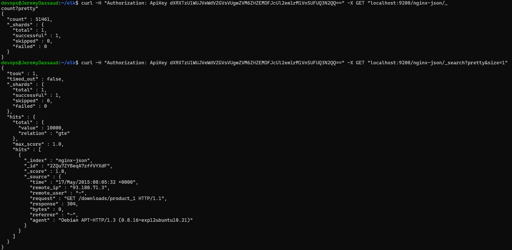

## Aller chercher les logs en json à l'URL:

wget https://raw.githubusercontent.com/elastic/examples/master/Common%20Data%20Formats/nginx_json_logs/nginx_json_logs

## Créer l'index pour les logs NGINX JSON

curl -X PUT "localhost:9200/nginx-json?pretty"

## Préparer les logs JSON pour l'indexation en bulk

cat > prepare_nginx_json.sh << 'EOF'
#!/bin/bash
while read line; do
echo "{\"index\":{\"\_index\":\"nginx-json\"}}"
echo "$line"
done < "$1"
EOF

- Puis :

chmod +x prepare_nginx_json.sh

## Convertir les logs et les indexer dans Elasticsearch

./prepare_nginx_json.sh nginx_json_logs > nginx_json_bulk.json

curl -H "Content-Type: application/x-ndjson" -H "Authorization: ApiKey R055TDU1WUJTdXBuT2xjN1ZYT0I6VmFFU01Rc283TF9lZDg5bXpBS2FHdw==" -X POST "localhost:9200/\_bulk?pretty" --data-binary @nginx_json_bulk.json

Resultat :

curl -H "Authorization: ApiKey R055TDU1WUJTdXBuT2xjN1ZYT0I6VmFFU01Rc283TF9lZDg5bXpBS2FHdw==" -X GET "localhost:9200/nginx-json/\_count?pretty"

curl -H "Authorization: ApiKey R055TDU1WUJTdXBuT2xjN1ZYT0I6VmFFU01Rc283TF9lZDg5bXpBS2FHdw==" -X GET "localhost:9200/nginx-json/\_search?pretty&size=1"

